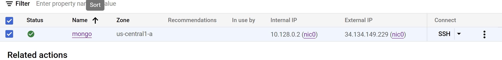
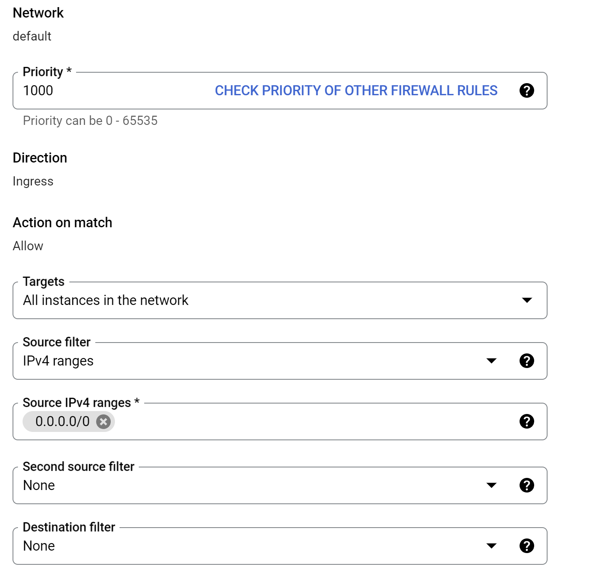
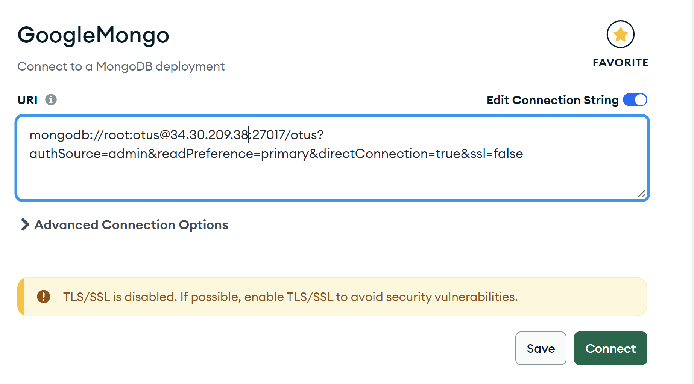
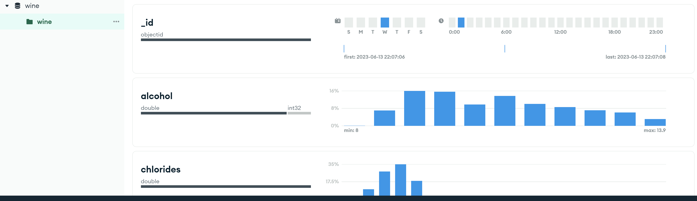
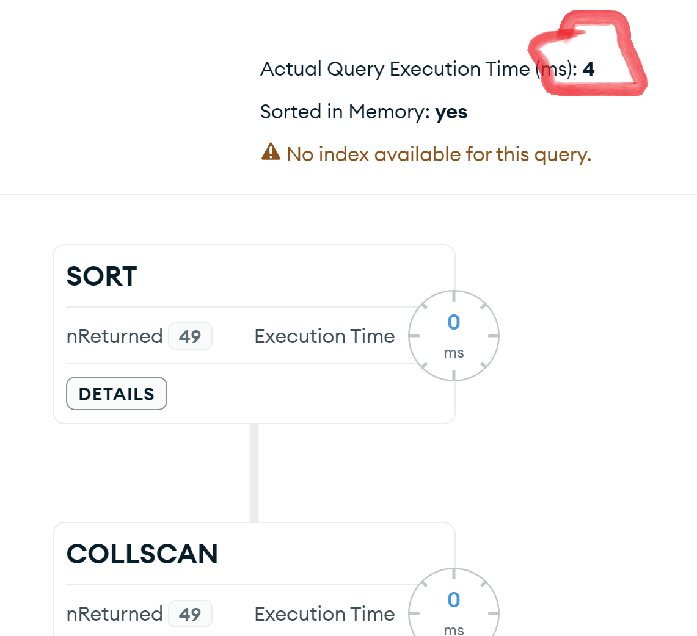
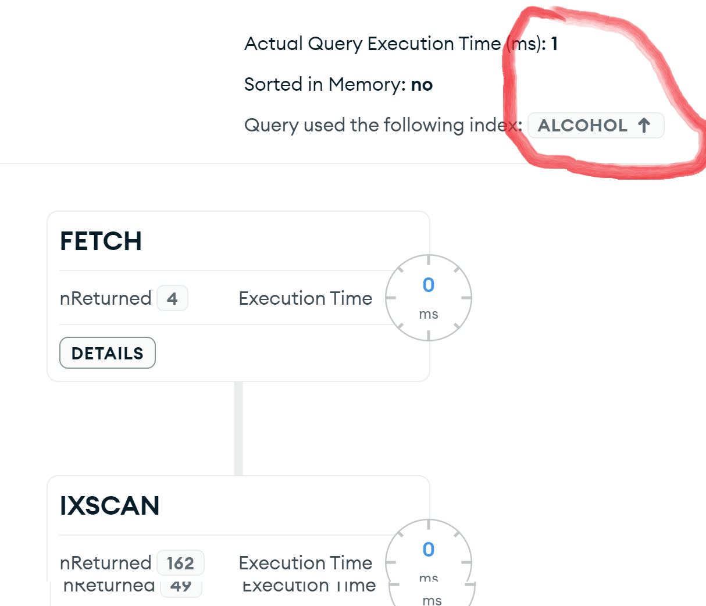

# Базовые возможности mongodb Домашка
## Установка Mongo на вируалку Google
* **Подключаюсь к виртуалке Google**  
 <code></code>

* **Следующими командами устанавливаю монго**  
    ```shell

        wget -qO - https://www.mongodb.org/static/pgp/server-6.0.asc | sudo apt-key add -
        echo "deb [ arch=amd64,arm64 ] https://repo.mongodb.org/apt/ubuntu focal/mongodb-org/6.0 multiverse" | sudo tee /etc/apt/sources.list.d/mongodb-org-6.0.list
        apt update
        apt-get install -y mongodb-org

    ```
    * **После установки  запускаю и проверяю статус** 

    ```shell
        sudo systemctl start mongod
        sudo systemctl status mongod
    ```
    ```bash   
                ● mongod.service - MongoDB Database Server
                    Loaded: loaded (/lib/systemd/system/mongod.service; disabled; vendor preset: enabled)
                    Active: active (running) since Tue 2023-06-13 21:38:57 UTC; 7s ago
                    Docs: https://docs.mongodb.org/manual
                Main PID: 1686 (mongod)
                    Memory: 227.3M
                    CGroup: /system.slice/mongod.service
                            └─1686 /usr/bin/mongod --config /etc/mongod.conf

                Jun 13 21:38:57 mongo systemd[1]: Started MongoDB Database Server.
                Jun 13 21:38:58 mongo mongod[1686]: {"t":{"$date":"2023-06-13T21:38:58.364Z"},"s":"I",  "c":"CONTROL",  "id":7484500, "ctx":"-","msg":"Environment variable M>
    ```

* **подключаюсь к базе и добовляю админа** 
     ```shell        
        use admin
        switched to db admin
        db.createUser( { user: "root", pwd: "otus", roles: [ "userAdminAnyDatabase", "dbAdminAnyDatabase", "readWriteAnyDatabase" ] } )
     ```
* **Далее включаю авторизацию в конфиге и разрешаю привязку ко всем сетевым интерфейсам  и рестартую монго**
   ```shell 
       vi /etc/mongod.conf
   ```
    ```shell        
            # network interfaces
            net:
            port: 2701

            bindIpAll: true
            # how the process runs
            processManagement:
            timeZoneInfo: /usr/share/zoneinfo

            security:
            authorization: enabled       
     ```
    ```shell
     sudo systemctl restart mongod
      ```
* **Далее пытаюсь подключиться к монго с помощью компас, однако соединение отваливатся по таймауту** 
* **Для того, чтоб всё заработало нужно прописать разрешения в фаерволе гугл-клауда** 
 
   
* **Подключился к монго черещз компасс** 

 

 * **Из сборника датасетов скачал датасет с характеристиками белых вин и загрузил их в новую созданную базу** 
   
* **Я выбрал вино не крепче 10 градусов и с низким содержанием диоксида серы** 
  
     ```json
      db.wine.find({'alcohol': {$lte: 10},'free sulfur dioxide': {$lt: 10}} ).sort({"alcohol": 1})  
     ```
* **Потом выбрал самое крепкое вино, оказалось только одно** 
     ```json
        wine> db.wine.aggregate([{$group:{_id:"$alcohol", ids:{$push:"$_id"}, count:{$sum:1}}}, {$sort:{"_id":-1}}, {$limit:1}])
        [
             {
            _id: 14.2,    
             count: 1
            }
        ]
     ```
* **Я проапдейтил базу, чтоб  лёгкое вин остало крепким** 
     ```json
            wine> db.wine.update({"alcohol" : {$lt: 10}}, {$set: {"alcohol": 40}}, {multi : true} )
            DeprecationWarning: Collection.update() is deprecated. Use updateOne, updateMany, or bulkWrite.
            {
                acknowledged: true,
                insertedId: null,
                matchedCount: 1923,
                modifiedCount: 1923,
                upsertedCount: 0
            }
     ```
     ```
* **Теперь крепкого вина в базе 1923шт, я проверил запросом** 
     ```json
            db.wine.aggregate([{$group:{_id:"$alcohol",  count:{$sum:1}}}, {$sort:{"_id":-1}}, {$limit:1}])
            [ { _id: 40, count: 1923 } ]

     ```

     
 * **Я выполнил первый запрос из отчёта и он выполнилася за 4 сек** 
  
   


* **Я я добавил индексы и запрос стал выполняться быстрее** 
  
   
  
  
